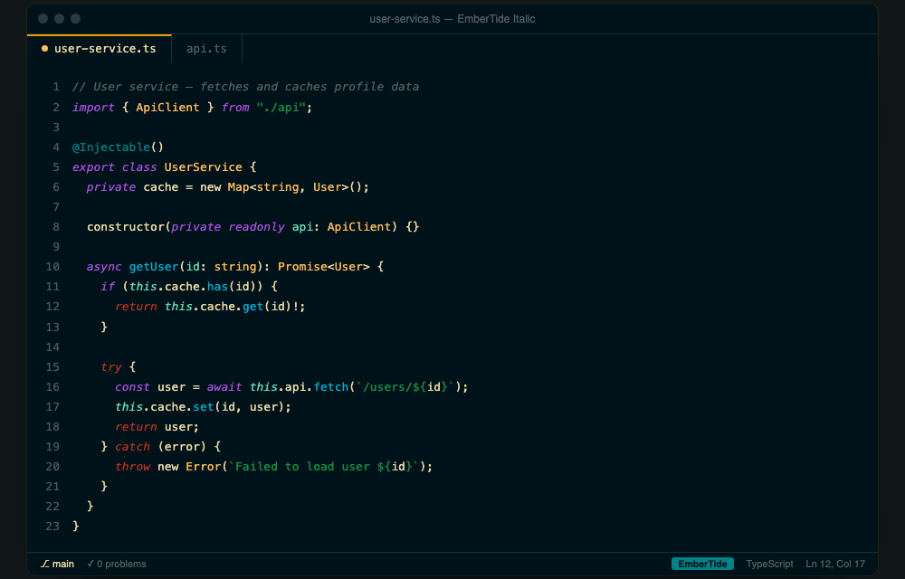

# EmberTide for VS Code

A complete VS Code theme — workbench UI and syntax highlighting — built and checked in
OKLCH for consistent contrast, hue separation, and saturation. Companion to
[dannyc87/embertide](https://github.com/dannyc87/embertide), the terminal theme family
this palette comes from, and to
[dannyc87/embertide-jetbrains](https://github.com/dannyc87/embertide-jetbrains) for
JetBrains IDEs. All three implement the same role mapping, defined once in
[embertide's SPEC.md](https://github.com/dannyc87/embertide/blob/main/SPEC.md).


Also ships **EmberTide Italic**, identical except keywords and control-flow lean italic:



## Install (local, unpacked)

```sh
mkdir -p ~/.vscode/extensions
cp -r . ~/.vscode/extensions/embertide-theme
```

Restart VS Code, then `Cmd/Ctrl+K Cmd/Ctrl+T` → **EmberTide**.

## Install (packaged)

```sh
npm install -g @vscode/vsce
vsce package
code --install-extension embertide-theme-1.0.0.vsix
```

## Regenerating

`themes/embertide-color-theme.json` and `package.json` are both generated by
[`scripts/build.py`](scripts/build.py) — don't hand-edit them. The palette in that
script is a manually-synced copy of
[embertide's `FINAL` dict](https://github.com/dannyc87/embertide/blob/main/scripts/build.py);
if the terminal theme's colors change, update `PALETTE` here to match and re-run:

```sh
python3 scripts/build.py
```

`icon.png` is generated separately by [`scripts/gen_icon.py`](scripts/gen_icon.py),
which needs Pillow and numpy (not otherwise required by this repo) — run it in a
throwaway venv rather than installing those system-wide:

```sh
python3 -m venv /tmp/iconenv && /tmp/iconenv/bin/pip install Pillow numpy
/tmp/iconenv/bin/python3 scripts/gen_icon.py
```

`assets/screenshot-hero.png` and `assets/screenshot-italic.png` are rendered from
[`mockups/hero.html`](mockups/hero.html) and [`mockups/hero-italic.html`](mockups/hero-italic.html)
via headless Chrome — those two HTML files have the theme's hex values copied in by
hand (they don't read from `PALETTE`), so update them manually if colors change:

```sh
scripts/gen_screenshots.sh
```

## Publishing a new version

1. Bump `VERSION` in `scripts/build.py`, then regenerate: `python3 scripts/build.py`.
2. Commit the result.
3. Tag and push: `git tag vX.Y.Z && git push origin vX.Y.Z`.

[`.github/workflows/publish.yml`](.github/workflows/publish.yml) picks up the tag,
confirms it matches `package.json`'s version, re-runs `scripts/build.py` to make sure
nothing committed is stale, and publishes with
[`vsce`](https://github.com/microsoft/vscode-vsce) using the `VSCE_PAT` repository
secret (Settings → Secrets and variables → Actions → New repository secret — a
Marketplace-scoped Personal Access Token from
[dev.azure.com](https://dev.azure.com)).

## License

MIT — see [LICENSE](LICENSE).
